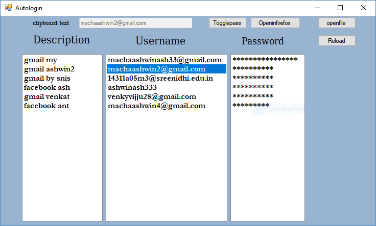

Autologin project
=================
### Execution 
1. First you need to install .net framework to Run this application

     download link [clickhere](https://github.com/user/repo/blob/branch/other_file.md)

2. After Installing .net framework download the project

3. Create a json file with name "json1.json"

  Demo file available in Autologin/Autologin/screenshots/ folder named json1.json
  
  copy this file and paste in your Documents folder 
  
  
   
  Replace the values with original ones

4. To execute go to Autologin-project/Autologin/Autologin/bin/Debug/autologin.exe

5. To view source and edit open Autologin-project/Autologin/Autologin.sln with visual studio
 
  some screenshots of application
  
  
  
  
### Usage

 1. Double click on description on any list item to open in chrome

 2. Click the item and click open in firefox to popen in firefox browser

 3. Double click the username or password list items to copy the text to clipboard

 4. The password is masked with stars but it copies password to text

 5. To see password click togglespass
