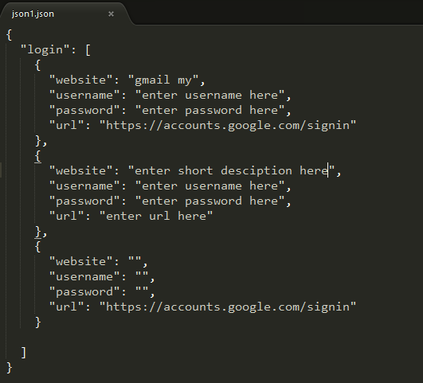
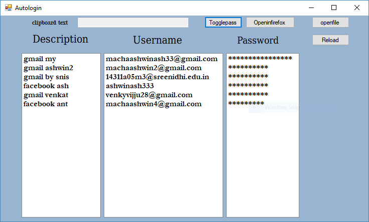

Autologin project
=================
### Execution 
1. First you need to install .net framework to Run this application

  download link [clickhere](https://github.com/user/repo/blob/branch/other_file.md)

2. After Installing .net framework download the project

3. Create a json file with name "json1.json"
  Demo file available in Autologin/Autologin/screenshots/ folder named json1.json
  take this file and paste in your Documents folder 
   
   Replace the values with original ones

4. To execute go to Autologin-project/Autologin/Autologin/bin/Debug/autologin.exe

5. To view and modify open Autologin-project/Autologin/Autologin.sln with visual studio
  and edit
  

  
  
